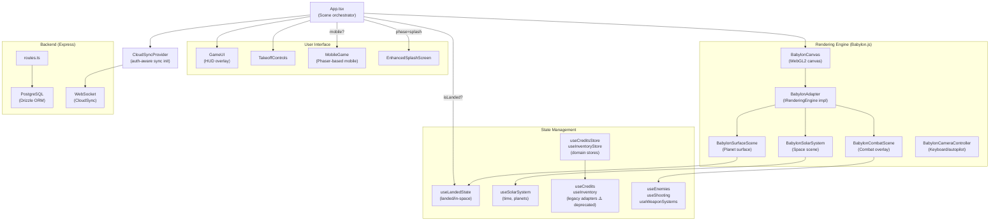

# Architecture Overview

Plunderverse is a 3D space outlaw game built with React (TypeScript), Babylon.js for all 3D rendering, and a Zustand state management system with a domain-driven design layer.

## System Diagram

## Major Systems

### 1. Rendering Engine
- **Interface**: `engine/interfaces/RenderingEngine.ts` — engine-agnostic API
- **Implementation**: `engine/adapters/BabylonAdapter.ts` — Babylon.js 8.x
- **Scenes**: Three Babylon scenes mounted inside one `BabylonCanvas`:
  - `BabylonSolarSystem` — space flight, 8 planets, orbital mechanics
  - `BabylonSurfaceScene` — planet surface, terrain, resource nodes
  - `BabylonCombatScene` — enemy ships, projectiles, explosions

### 2. State Management
- **Domain stores** (`client/src/domain/`): Preferred. `useCreditsStore`, `useInventoryStore`, `economyService`
- **Legacy stores** (`client/src/lib/stores/`): Backward-compatible adapters, marked `@deprecated`
- Scene selection driven by `useLandedState.isLanded`

### 3. Game Loop
- Babylon.js owns the render loop (`engine.runRenderLoop`)
- Per-frame updates registered via `engine.registerUpdateCallback(id, (delta, elapsed) => ...)`
- Orbital mechanics run in `BabylonSolarSystem` update callback
- Enemy AI runs in `BabylonCombatScene` update callback

### 4. Mobile Experience
- Separate `MobileGame` component using Phaser 3 for an arcade-style mobile game
- Detected by viewport width < 768px or `usePlatform.platformType === 'mobile'`

### 5. Cloud Sync
- Two sync managers: `CloudSyncManager` (WebSocket, newer) and `cloudSyncManager` (REST, older)
- Both initialized on login via `providers/CloudSyncProvider.tsx` (wraps App root)
- Provider handles auth state subscription, init on login, cleanup on logout

### 6. Audio
- Howler.js managed through `useAudio` hook
- Category-based volume: music, SFX, parrot, ambient
